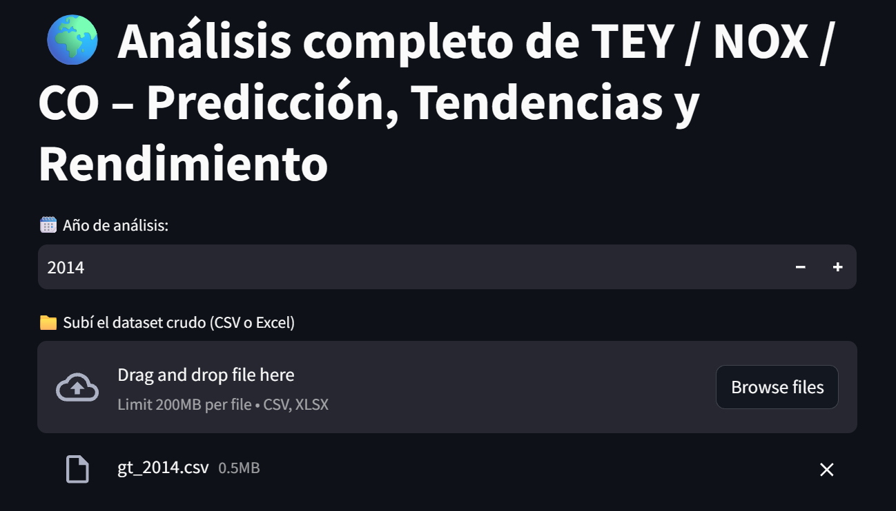
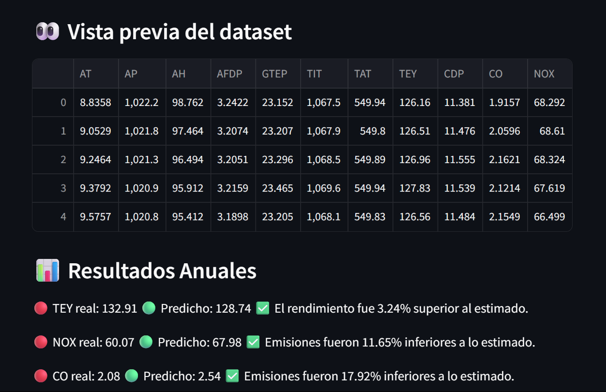
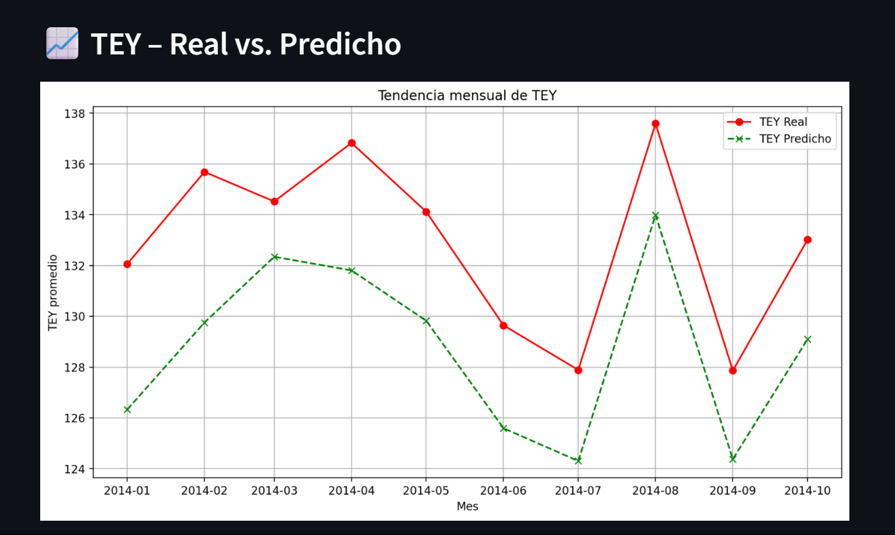
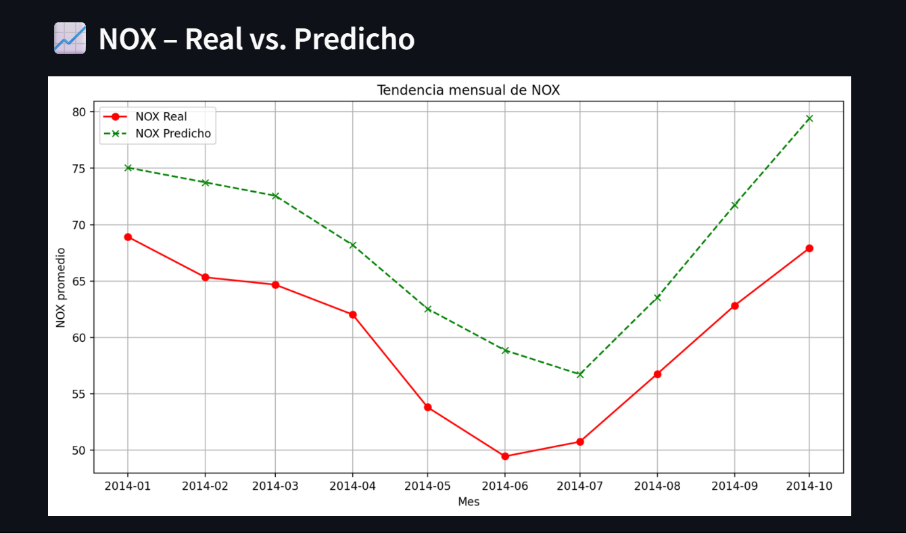
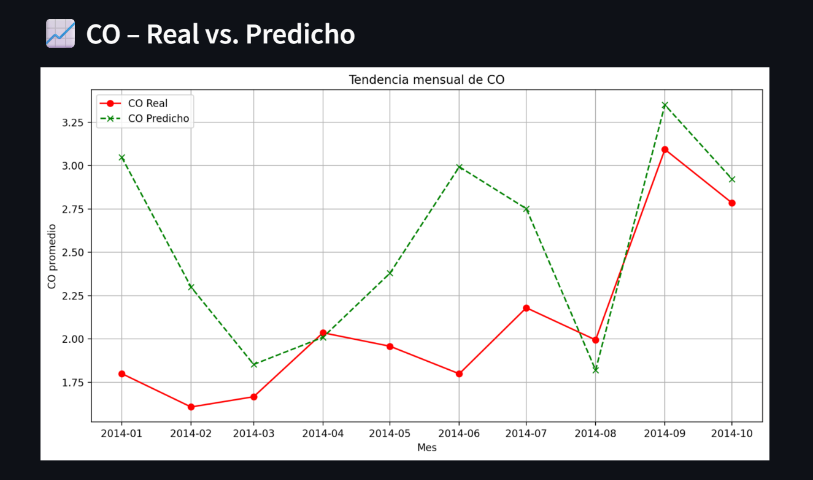

# Predicción de Emisiones y Rendimiento Energético en Turbinas de Gas
Este proyecto utiliza datos de sensores de una turbina de gas ubicada en el noroeste de Turquía para desarrollar modelos específicos para cada variable de interés: el rendimiento energético neto (TEY) y las emisiones de gases contaminantes (CO y NOX).
El objetivo principal es evaluar el comportamiento real de la turbina durante un año ya transcurrido, comparando los valores reales registrados con los valores estimados por los modelos entrenados. Esto permite identificar desviaciones significativas en rendimiento y emisiones, y analizar tendencias mensuales de forma detallada.
Por ejemplo, si se esperaba un rendimiento anual del 160% y se obtuvo 140%, el sistema permite visualizar esa diferencia y entender su evolución mes a mes.

## Introducción
El conjunto de datos contiene 36,733 instancias con 11 variables medidas por sensores, agregadas por hora entre 2011 y 2015 (las fechas no se proporcionan en las instancias, pero los datos están ordenados cronológicamente.). Las variables incluyen parámetros ambientales y operativos como: 
- Temperatura ambiente (AT)
- Presión ambiente (AP)
- Humedad relativa (AH)
- Temperatura de entrada/salida de la turbina (TIT/TAT)
- Emisiones de CO y NOX

Se sigue el protocolo de entrenamiento con los primeros tres años y prueba con los últimos dos años, garantizando reproducibilidad.

## Análisis Exploratorio
- No se encontraron valores nulos ni duplicados.
- Se identificaron y eliminaron outliers usando el método IQR.
- Se analizaron rangos y correlaciones entre variables.

## Selección de Variables y Modelado Predictivo
Para cada variable objetivo (TEY, CO y NOX), se realizó un análisis previo utilizando regresión lineal (OLS) y regularización (Elastic Net) con el fin de identificar y eliminar variables con baja significancia o alta multicolinealidad. Esto permitió depurar el conjunto de características y mejorar la eficiencia de los modelos posteriores.

**Modelo Base**

Antes de aplicar técnicas avanzadas, se entrenó un modelo base utilizando DecisionTreeRegressor sin optimización de hiperparámetros. Este modelo sirvió como referencia inicial para evaluar el rendimiento de los algoritmos más complejos.

**Comparación de Modelos**

Luego se implementaron pipelines de modelado con búsqueda de hiperparámetros (RandomizedSearchCV) para comparar los siguientes algoritmos:

•	Decision Tree
•	Random Forest
•	Gradient Boosting
•	Support Vector Machine (SVR)

Cada pipeline incluyó escalado (StandardScaler), validación cruzada y evaluación con métricas como R², MAE, RMSE y desvío estándar de CV.
Para cada variable objetivo (TEY, CO, NOX), se compararon los resultados obtenidos por los distintos modelos para seleccionar el más preciso y estable.
Además, se utilizó un modelo base (árbol de decisión sin optimización) como referencia para validar si los modelos optimizados ofrecían mejoras significativas en rendimiento.

**Mejores modelos seleccionados**
| Variable | Modelo seleccionado | 
|----------|---------------------|
| TEY      | SVR                 |
| CO       | Random Forest       |
| NOX      | Gradient Boosting   |

**Métricas de Evaluación**

• TEY
| Modelo| R²     | MAE    | RMSE    | Std CV   |  
|-------|--------|--------|---------|----------|
| SVR   | 0.9985 | 0.4130 | 0.6261  | 0.0003   |

• CO
| Modelo | R²     | MAE    | RMSE    | Std CV  | 
|--------|--------|--------|---------|---------|
| Forest | 0.7555 | 0.5856 | 1.1182  | 0.0119  | 

• NOX
| Modelo   | R²     | MAE    | RMSE   | Std CV | 
|----------|--------|--------|--------|--------|
| Gradient | 0.8686 | 2.7441 | 3.9543 | 0.0068 | 

## Dashboard Interactivo en Streamlit
Se implementa una app web para:

• Subir datasets crudos (CSV o Excel)
• Seleccionar año de análisis
• Validar columnas necesarias
• Predecir TEY, NOX y CO
• Visualizar tendencias mensuales y diferencias porcentuales
• Mostrar interpretaciones automáticas

### Capturas Streamlit

### Ejecución
>Bash: streamlit run Gas_st.py